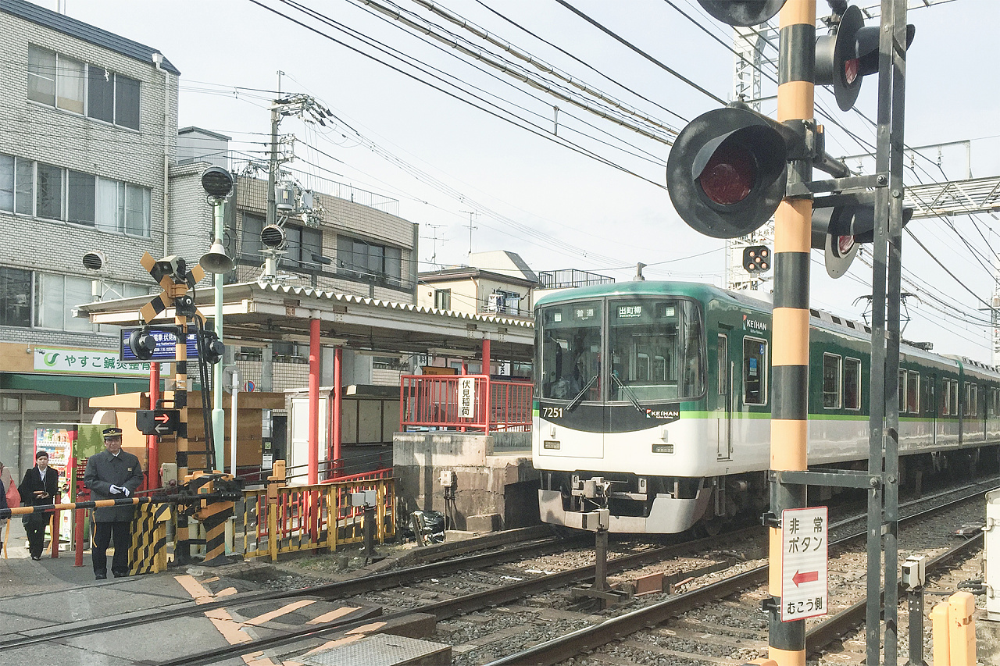
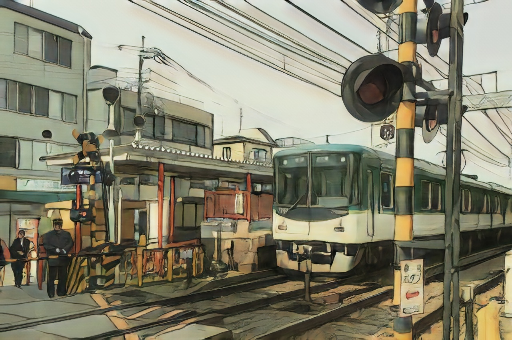

# Paddle Implementation of AnimeGANv2

* Reference
    * [animegan2-pytorch](https://github.com/bryandlee/animegan2-pytorch)
    * [AnimeGANv2](https://github.com/TachibanaYoshino/AnimeGANv2)
    * [AnimeGANv2](https://tachibanayoshino.github.io/AnimeGANv2/)
* The code is heavily based on [animegan2-pytorch](https://github.com/bryandlee/animegan2-pytorch).


# Usage

```shell
python test.py --input_dir ./samples/inputs/ --output_dir ./output
```

Input images:

<div align="center">

</div>


Output images:


<div align="center">

</div>
